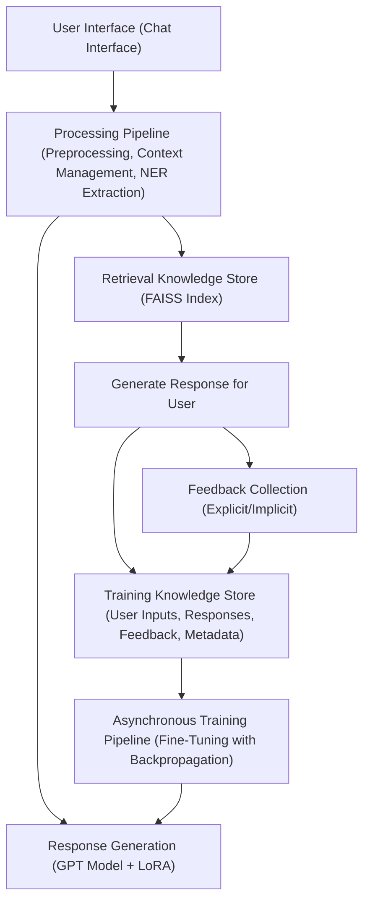

```mermaid
graph TD
    UI["User Interface (Chat Interface)"] --> PP["Processing Pipeline (Preprocessing, Context Management, NER Extraction)"]
    PP --> RG["Response Generation (GPT Model + LoRA)"]
    
    PP --> RK["Retrieval Knowledge Store (FAISS Index)"]
    RK --> GR["Generate Response for User"]
    
    GR --> FC["Feedback Collection (Explicit/Implicit)"]
    GR --> TKS["Training Knowledge Store (User Inputs, Responses, Feedback, Metadata)"]
    
    FC --> TKS
    
    TKS --> ATP["Asynchronous Training Pipeline (Fine-Tuning with Backpropagation)"]
    ATP --> RG
```